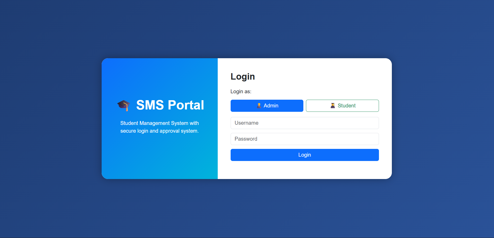
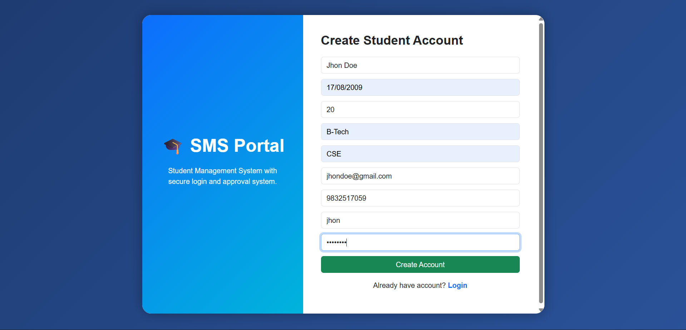
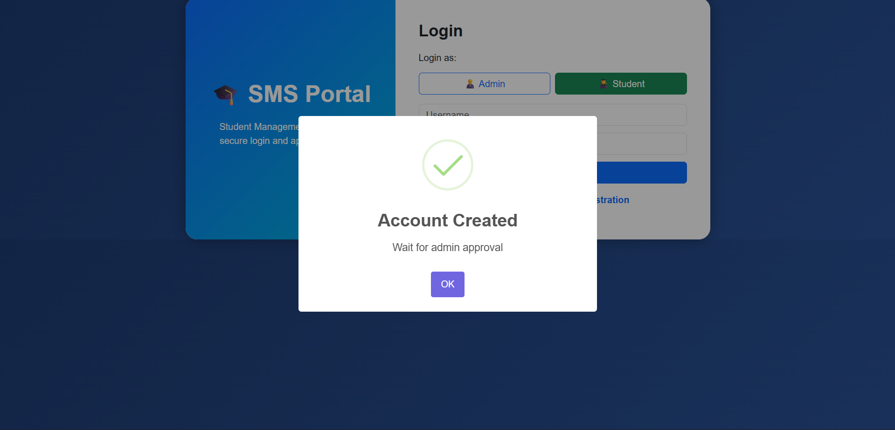
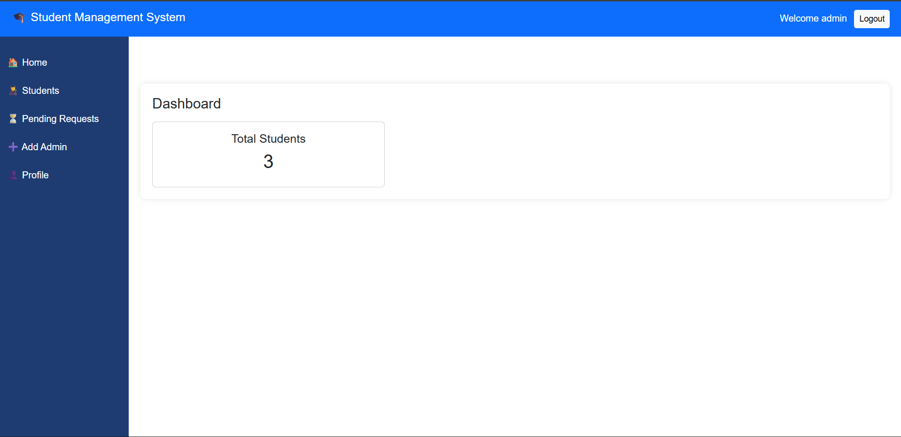
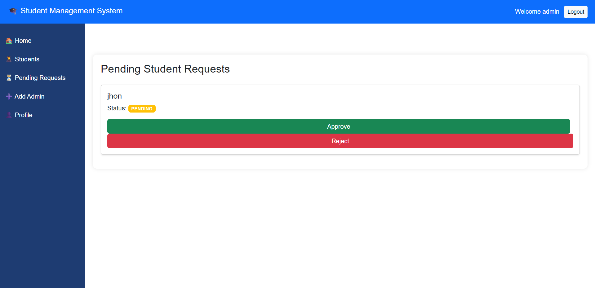
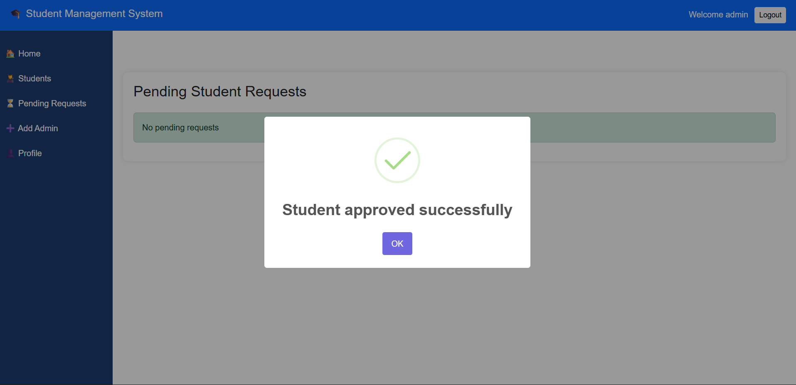
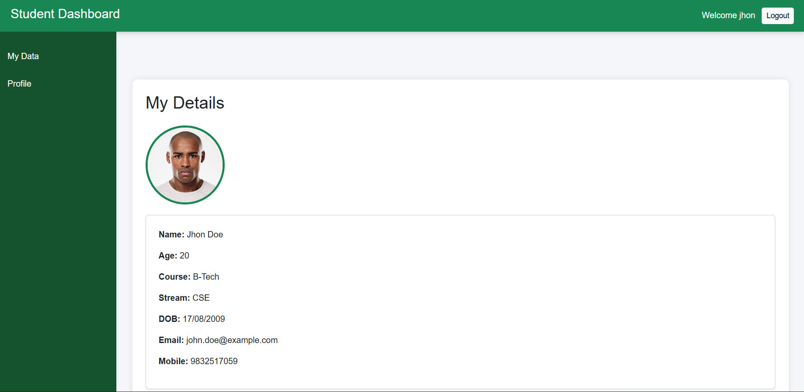

# Student Management System

A web-based Student Management System built with **Java, Spring Boot, MySQL, HTML, CSS, and JavaScript**.

The system provides separate workflows for **Admin and Student users**, including student registration, approval-based account activation, student profile management, and administrative student record management.

---

## 🚀 Demo

### 🎥 Project Demo

[▶️ Watch the Student Management System Demo](Project-Demo/Student-Management-System-Demo.mp4)

The demo demonstrates the complete workflow:

**Student Registration → Admin Approval → Student Login → Student Dashboard → Student Management**

---

## 📸 Screenshots

### 🔐 Login



### 📝 Student Registration



### ✅ Account Creation



### 🛠️ Admin Dashboard



### ⏳ Pending Student Requests



### ✔️ Student Approval



### 🎓 Student Dashboard



> The complete Student Management workflow, including student search, profile information, profile photo, and editing student records, is demonstrated in the project video above.

---

## ✨ Key Features

### 👨‍🎓 Student

- Student registration
- Approval-based account activation
- Student login
- Student dashboard
- View personal information
- Update profile information
- Change username and password
- Secure password storage using BCrypt

### 👨‍💼 Admin

- Admin login
- Admin dashboard
- View student records
- Search student information
- Review pending student registration requests
- Approve or reject student requests
- Add new admin accounts
- Update student information
- Delete student records
- Update admin profile

---

## 🔄 Application Workflow

```text
Student
   │
   ├── Register Account
   │
   ▼
Pending Approval
   │
   ▼
Admin Reviews Request
   │
   ├── Reject ──► Account Removed
   │
   └── Approve
          │
          ▼
     Student Login
          │
          ▼
    Student Dashboard
```

---

## 🛠️ Technologies Used

| Technology | Purpose |
|---|---|
| Java | Application development |
| Spring Boot | Backend and web application framework |
| MySQL | Database |
| JDBC | Database connectivity |
| HTML | Web page structure |
| CSS | User interface styling |
| JavaScript | Frontend interaction |
| Maven | Project build and dependency management |
| Git & GitHub | Version control |

---

## 📂 Project Structure

```text
src/
├── main/
│   ├── java/
│   │   └── com/example/demo/
│   │       ├── controller/
│   │       ├── model/
│   │       ├── repository/
│   │       ├── service/
│   │       ├── security/
│   │       └── DemoApplication.java
│   │
│   └── resources/
│       ├── static/
│       └── templates/

Project-Demo/
└── Student-Management-System-Demo.mp4

screenshots/
├── 01-login.png
├── 02-student-registration.png
├── 03-account-created.png
├── 04-admin-dashboard.png
├── 05-pending-requests.png
├── 06-approval-success.png
└── 07-student-dashboard.png

pom.xml
README.md
```

---

## ⚙️ Setup & Installation

### 1. Clone the repository

```bash
git clone https://github.com/anirudha-hensh/student-management-system.git
cd student-management-system
```

### 2. Create the MySQL database

Create a database named:

```sql
CREATE DATABASE student_db;
```

### 3. Configure the application

Create your local Spring Boot configuration in:

```text
src/main/resources/application.properties
```

Example:

```properties
spring.datasource.url=jdbc:mysql://localhost:3306/student_db
spring.datasource.username=root
spring.datasource.password=YOUR_MYSQL_PASSWORD

spring.jpa.hibernate.ddl-auto=update
spring.jpa.show-sql=true
```

> **Do not commit your real database password to GitHub.**

### 4. Configure JWT Secret

The application uses the `JWT_SECRET` environment variable for JWT signing.

On Windows:

```cmd
setx JWT_SECRET "YOUR_BASE64_SECRET"
```

> Open a new terminal after setting the environment variable.

### 5. Run the application

Using Maven Wrapper:

```cmd
mvnw.cmd spring-boot:run
```

Or build the project:

```cmd
mvnw.cmd clean package
```

Then run the generated JAR file.

---

## 🔐 Security

The application includes:

- BCrypt password hashing
- JWT-based authentication
- Role-based access for Admin and Student users
- Environment-based JWT secret configuration
- Local database credentials kept outside the public repository

---

## 👨‍💻 Developer

**Anirudha Hensh**

B.Tech — Computer Science & Engineering  
University of Engineering & Management, Kolkata

- 🌐 [Portfolio](https://anirudha-portfolio-e1m3.vercel.app/)
- 💼 [LinkedIn](https://linkedin.com/in/anirudhahensh)
- 💻 [GitHub](https://github.com/anirudha-hensh)

---

## 📄 License

This project was developed as a personal academic/portfolio project.
